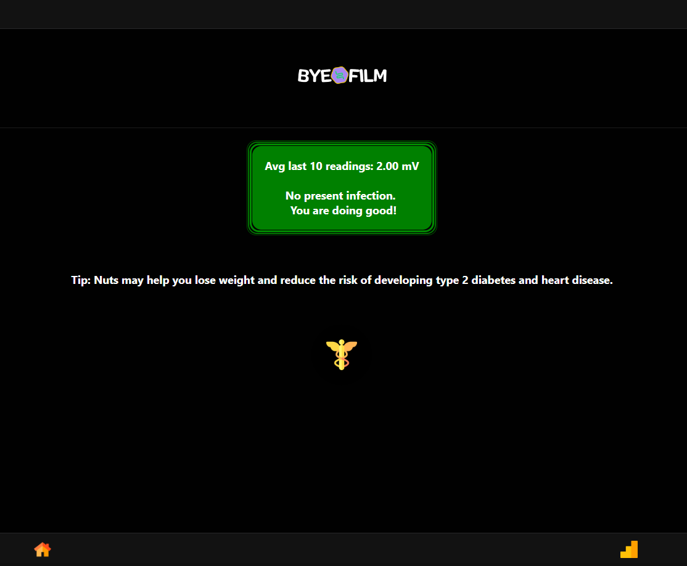
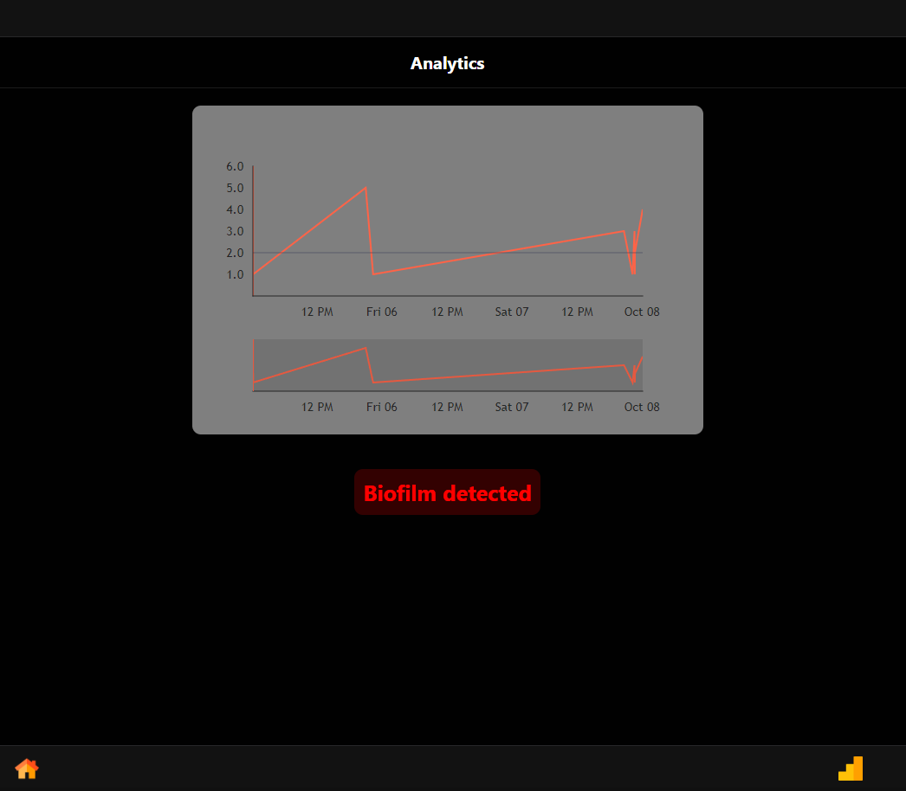
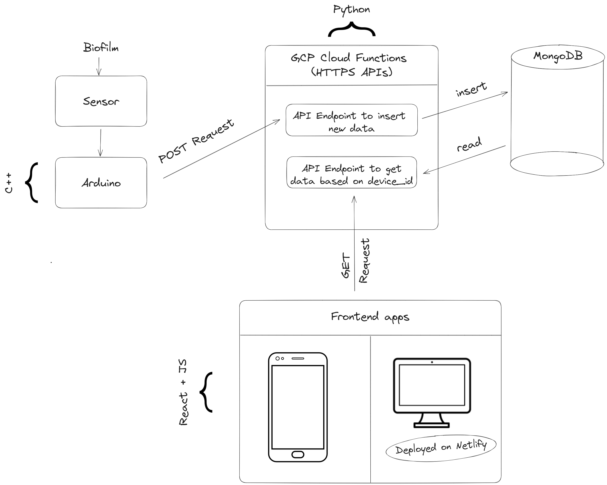

# Byeofilm - Groningen iGEM 2023

#### Description

Our project focuses on the development of modular bacterial biosensors, an interesting approach in the field of medical technology. These biosensors leverage the power of engineered bacteriophages to detect and combat biofilms that can form on implants, particularly prosthetic joints.

Prosthetic joint infections, while rare, present a formidable challenge for medical specialists due to their elusive and resistant nature. Our goal is to create a comprehensive toolkit that addresses this challenge by integrating various components:

- **Biofilm Detection:** Our biosensors are designed to detect the formation of biofilms, offering early detection capabilities crucial for proactive infection management.

- **Phage-Based Disruption:** Once a biofilm is identified, the toolkit deploys bacteriophages to disrupt the biofilm lattice, a novel approach that holds promise for more effective treatment.

- **Real-Time Communication:** The biosensor is seamlessly connected to an electronic device, allowing real-time reporting of biofilm infections. This ensures that medical professionals have immediate access to critical patient data.

- **Mobile/Web Application:** To enhance usability and accessibility, our toolkit includes a mobile and web application. It provides a user-friendly interface for patients and medical specialists to access and interpret results, facilitating informed decision-making.

## Usage (+ Links)

#### Screenshots:

#### Links:

- Web app: https://byeofilm.netlify.app/

- Android APK: [byeofilm_android.apk - Google Drive](https://drive.google.com/file/d/1eZaAkOLQ1g3FwBbUJoVsj8Y27iPxk6zW/view?usp=sharing)

## Architecture

**High-level overview of the software architecture**

#### Arduino/Sensor Code (Acting as the Medical Device):

*Architectural Significance:*

The foundation of our software begins with the Arduino-based sensor code. This critical component is responsible for collecting data from the sensor and transmitting it securely to our cloud infrastructure. The significance of this component lies in its role as the data acquisition layer, ensuring the accurate and timely capture of biofilm formation data. It is written in C++. 

*Real Time Data Acquisition:*

The Arduino code reads and sends the data to our database in real-time. This enables patients to proactively detect infections as they begin to form. This early detection is vital in biofilm infection management, providing patients with a critical advantage in their healthcare journey. 

#### Google Cloud Platform (GCP) Cloud Functions + MongoDB (Acting as the Backend):

The GCP Cloud Functions serve as the backbone of our software, acting as the backend that interacts with our MongoDB database. This component is responsible for data ingestion, storage, and retrieval. Its architectural significance lies in its ability to provide a robust and scalable infrastructure for data management.

*Database Design / Choice:*

MongoDB plays a pivotal role in our software's architecture as the database solution of choice. Its selection is driven by several key considerations:

- Flexibility: MongoDB is a NoSQL database known for its flexibility, which makes it suitable for handling diverse data structures and formats. This flexibility is invaluable when dealing with the complex and evolving nature of biofilm formation data.

- Scalability: MongoDB's horizontal scalability allows us to expand our data storage capabilities as needed. This is crucial in a medical context where data volumes can grow rapidly.

- Efficient Querying: MongoDB's query language and indexing capabilities enable efficient data retrieval, which is vital for medical specialists and researchers when accessing historical biofilm data for analysis and treatment optimization.

- Real-Time Data: MongoDB supports real-time data updates, ensuring that biofilm data is always up-to-date and accessible in real-time for medical professionals. This real-time aspect is critical for timely interventions and patient care.

*Scalability and Reliability:*

Our choice of Google Cloud Platform (GCP) Cloud Functions ensures the scalability and reliability of the backend infrastructure. It can seamlessly handle varying levels of data traffic, accommodating the demands of a medical application with real-time data requirements.

*Python-Powered Functionality:*

The Cloud Functions are written in Python, a versatile and widely-used programming language. This choice of language enables the seamless execution of critical functions, such as data storage, retrieval, and communication with the frontend. Python's readability and extensive library support contribute to the maintainability and extensibility of the backend.

*Cost-Efficient Prototyping:*

Our backend stack of GCP Cloud Functions and MongoDB offers a budget-friendly solution for prototyping. Both of these services offer free-tier/trial usages during the initial stages of software development and deployment, when traffic isn’t substantial. This affordability makes prototyping more accessible, enabling us to iterate and refine our software without any financial constraints.

#### Phone/Web App (Acting as the Frontend):

*Architectural Significance:*

The frontend of our software is the user-facing component, comprising both a mobile phone application and a web application. This component plays a pivotal role in delivering biofilm data to medical specialists and patients in an accessible and intuitive manner.

*Cross-Platform Accessibility:*

Our architectural approach ensures cross-platform accessibility, allowing users to access the software from their preferred devices, be it smartphones or web browsers. This adaptability is achieved through the use of React, a JavaScript library for building user interfaces. We chose React for its capability to create responsive and dynamic web and mobile applications efficiently. This choice aligns with our commitment to user-friendliness.

*Real-Time Data Visualization:*

The frontend component offers real-time data visualization, enabling users to monitor biofilm formation dynamics as they occur. This feature empowers patients and medical specialists with timely insights into biofilm formations, fostering informed decision-making and precise treatment strategies.

## How to Run Locally

As stated, there are three separate components/code for this project.

In each folder in this repo ("arduino_code", "gcp_endpoints" and "frontend_app") you will find a README which describes how to run the corresponding code.

## Authors

The iGEM 2023 Groningen Team
