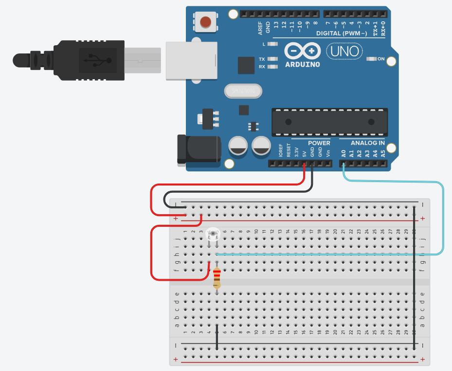
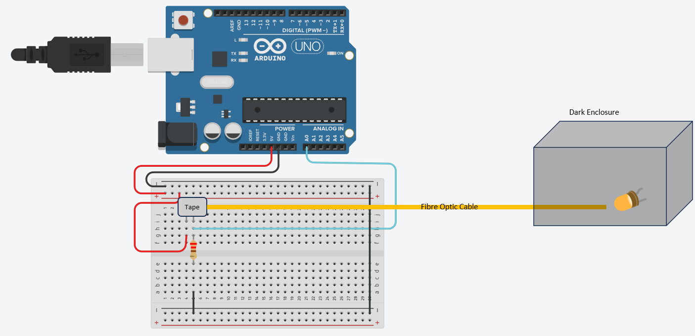

# Arduino Code

## Description

As described at the root of this repo, the Arduino will act as an electronic device, allowing real-time reporting of biofilm infections. 

## Requirements

Before you begin, ensure you have met the following requirements:

- [Arduino IDE](https://www.arduino.cc/en/software) installed on your computer.
- The [WiFiNINA - library installed](https://www.arduino.cc/reference/en/libraries/wifinina/).

## Components

- Fiber Optic Cable Bare Polymer Plastic diameter 3 mm OMPF3000 Farnell
- NPN Phototransistor 570nm (TEPT5600), peak sensitivity 570 nm
- SBC Arduino UNO WiFi Rev2 PCE 45,68 ATmega4809 8bi
- Resistor 220Ω
- USB cable
- Jumper Wire kit
- Breadboard
- Tape

## Sketch

#### The Whole Setup

## Getting Started

To get this project up and running, follow these steps:

1. **Clone the Repository.**
2. **Recreate the sketch:**
   - Recreate the sketch shown above.
   - For more info, read more [here](https://2023.igem.wiki/groningen/electronics).
3. **Open the Arduino Sketch:**
   - Launch the Arduino IDE.
   - Go to `File` > `Open` and select the `arduino_code/read_sensor_and_send_to_api.ino` file from the cloned repository.
4. **Set Up Your Arduino:**
   - Connect your Arduino board to your computer via USB.
   - Select the correct board and port from the `Tools` menu in the Arduino IDE.
5. **Compile and Upload:**
   - Click the "Upload" button (right arrow icon) in the Arduino IDE.
   - Wait for the code to compile and upload to your Arduino board.
6. **Read the values from the sensor on the Serial Monitor (in Arduino IDE):**
   - And if you create your own Endpoints, these values will be saved into your database.
